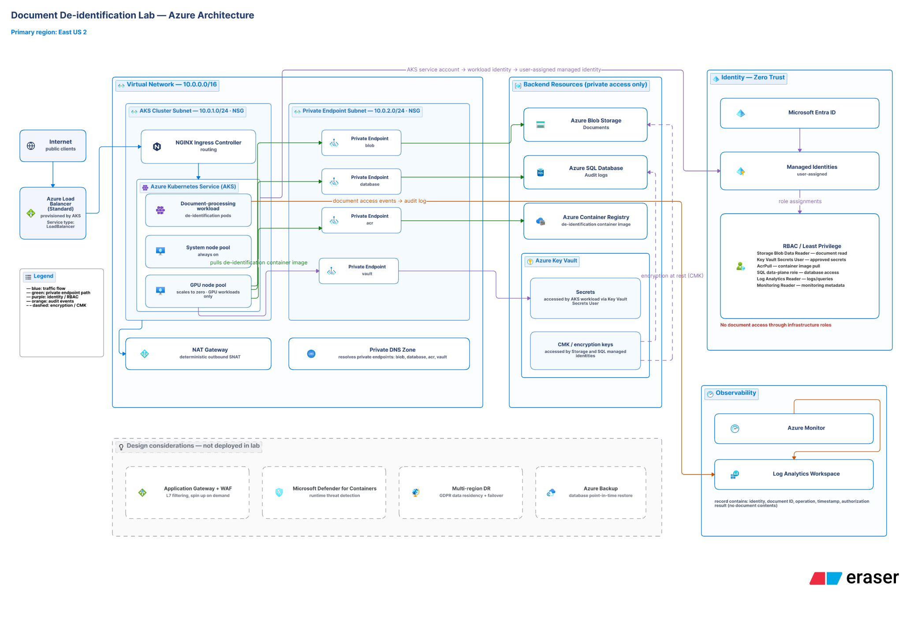

# Document De-identification Lab — Azure (AKS + Terraform)

A production-minded Azure reference build for a **self-hosted document de-identification service** — a workload that detects and redacts PII/PHI from clinical-style documents before they move into research, analytics, or downstream systems. Designed with a healthcare and pharma audience in mind, where protected health information can never leak and every access must be provable.

The entire environment is defined in Terraform and built to demonstrate the security and cost decisions a cloud engineer actually makes: sensitive data that never traverses the public internet, identity-based access with least privilege, customer-controlled encryption, a defensible audit trail, and deliberate separation of what a lab deploys versus what production would add.

---

## Architecture



*Primary region: East US 2.*

**Ingress path.** Public clients reach the service through an Azure Standard Load Balancer (provisioned by AKS via a `Service type: LoadBalancer`), which routes to an NGINX ingress controller running inside the cluster.

**Compute.** An AKS cluster runs three logical workloads: the **document-processing workload** (the de-identification pods), a small **system node pool** that stays always on, and a **GPU node pool** that scales to zero when idle, so GPU cost is only incurred while documents are actively being processed.

**Segmented network.** Everything sits inside a single virtual network (`10.0.0.0/16`), split into an **AKS cluster subnet** (`10.0.1.0/24`) and a **private endpoint subnet** (`10.0.2.0/24`), each with its own network security group. Outbound traffic leaves through a **NAT Gateway** providing deterministic outbound SNAT — no cluster node holds a public IP. A **private DNS zone** resolves the private endpoints for blob, database, ACR, and vault.

**Private data plane.** All backend resources are reachable only through private endpoints, never the public internet:
- **Azure Blob Storage** — documents
- **Azure SQL Database** — audit logs
- **Azure Container Registry** — the de-identification container image
- **Azure Key Vault** — application secrets and customer-managed encryption keys

**Zero-trust identity.** The AKS service account federates to a user-assigned managed identity via workload identity, so the workload authenticates with no static credentials in code. Access is granted through narrowly scoped Azure RBAC roles — `Storage Blob Data Reader`, `Key Vault Secrets User`, `AcrPull`, a SQL data-plane role, `Log Analytics Reader`, and `Monitoring Reader`. Infrastructure roles grant no path to document data.

**Encryption.** Key Vault holds two distinct things kept on separate access paths: application **secrets** (read by the workload via `Key Vault Secrets User`) and **customer-managed keys** (used by the storage and database managed identities to encrypt data at rest).

**Audit.** The document-processing workload emits an event on every document access — identity, document ID, operation, timestamp, and authorization result, and never the document contents — to a Log Analytics workspace via Azure Monitor.

**Deferred by design.** Application Gateway + WAF, Microsoft Defender for Containers, multi-region DR, and Azure Backup are documented as design considerations rather than deployed — a deliberate cost decision for a lab, with the production reasoning made explicit rather than hidden.

---

## Design principles

- **Private by default** — protected data never touches the public internet.
- **Identity over secrets** — federated workload identity and least-privilege RBAC instead of stored credentials.
- **Cost-conscious by construction** — the whole environment tears down and rebuilds between sessions; the GPU pool scales to zero; nothing runs that isn't being used.
- **Reusable** — nothing subscription-specific is hardcoded; anyone can clone and deploy into their own subscription.
- **Honest scope** — what's deployed and what's deferred are clearly separated, with reasons.

---

## Prerequisites

- An Azure subscription
- [Azure CLI](https://learn.microsoft.com/en-us/cli/azure/install-azure-cli) installed and authenticated (`az login`)
- [Terraform](https://developer.hashicorp.com/terraform/install) v1.9 or newer
- [kubectl](https://kubernetes.io/docs/tasks/tools/) to interact with the cluster

Sufficient vCPU quota is needed in your region for the node pool SKUs. If a deployment fails with a quota or SKU-availability error, check what's available with:

```bash
az vm list-usage --location <your-region> --output table
```

---

## Configuration

All configurable values are Terraform variables — nothing subscription-specific is hardcoded.

1. Copy the example variables file:

   ```bash
   cp terraform.tfvars.example terraform.tfvars
   ```

2. Set your subscription ID in `terraform.tfvars`:

   ```hcl
   subscription_id = "<your-azure-subscription-id>"
   ```

`terraform.tfvars` is gitignored and never committed. Region, resource group name, and node SKUs have sensible defaults in `variables.tf` and can be overridden here.

> Subscription and tenant IDs are identifiers, not secrets, so they're safe to reference. Credentials (client secrets, access keys) must never be committed — this lab authenticates via your local Azure CLI session, so no secret is stored in code.

---

## Deploy

```bash
terraform init
terraform plan
terraform apply
```

Connect to the cluster after apply:

```bash
az aks get-credentials --resource-group <rg-name> --name <cluster-name> --overwrite-existing
kubectl get nodes
```

---

## Tear down

```bash
terraform destroy
```

This removes the cluster, the resource group, and the AKS-managed `MC_` resource group automatically. Confirm clean state with:

```bash
terraform show   # reports no resources after destroy
```

Rebuild takes only a few minutes, so the environment is only ever running while in active use — the core cost strategy.

---

## Repository structure

```
.
├── main.tf                    # resource group + module calls
├── providers.tf               # Terraform + azurerm provider config
├── variables.tf               # root input variables
├── outputs.tf                 # root outputs
├── terraform.tfvars.example   # template for your own values (committed)
├── terraform.tfvars           # your actual values (gitignored)
├── .gitignore
├── docs/
│   └── architecture.png       # architecture diagram (referenced above)
└── modules/
    └── aks/                   # AKS cluster module
        ├── main.tf
        ├── variables.tf
        └── outputs.tf
```

State is kept locally for this solo lab (gitignored, backed up to a private repo — never the public one). For team use, switch to a remote backend such as an Azure Storage account.

---

## Build status

Built incrementally against a public backlog (features → epics → user stories, each with acceptance criteria — see the repo Issues). Phases:

1. **Repeatable, low-cost lab platform** — walking skeleton, teardown/rebuild ✅ *complete*
2. **Secure-by-default network** — segmented VNet, NSGs, controlled egress, private endpoints, private DNS — *in progress*
3. **Zero-trust identity & encryption** — workload identity, least-privilege RBAC, Key Vault secrets + customer-managed keys — *planned*
4. **De-identification service & audit trail** — the GPU-backed redaction workload and document-access audit log — *planned*
5. **Operational visibility** — Container Insights and centralized logging — *planned*
